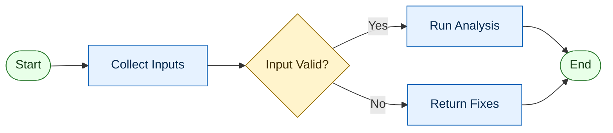
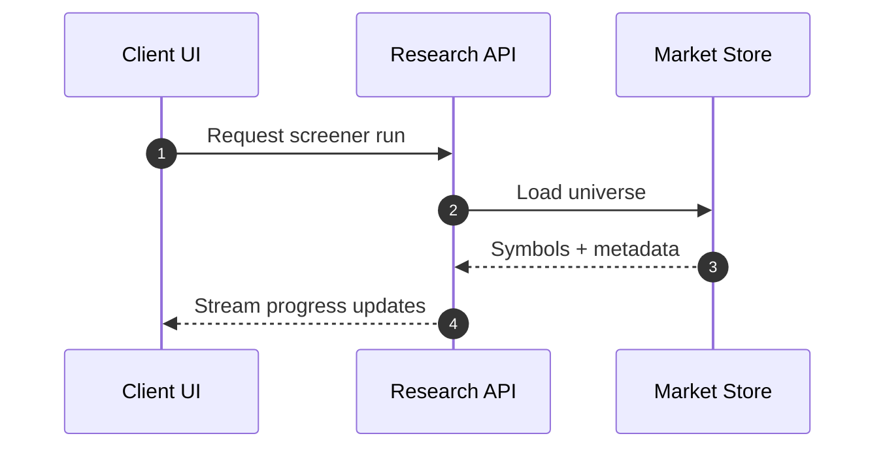
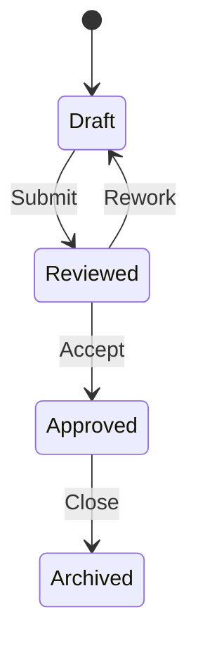
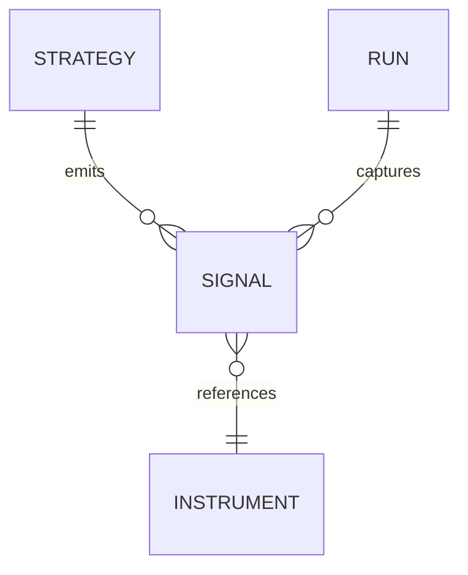

# Mermaid Design Guide

## Layout Checklist

- Choose one flow direction and keep it consistent.
- Group related nodes with `subgraph` and clear titles.
- Keep edge count per node low; split overloaded hubs.
- Prefer orthogonal reading paths over crisscross diagonals.
- Keep diagram depth balanced; avoid one very long branch.

## Labeling Checklist

- Use action-first labels (`Validate Order`, `Fetch Quotes`).
- Keep labels short and scannable.
- Keep tense and grammar consistent across the diagram.
- Use abbreviations only if they are obvious to the audience.

## Styling Checklist

- Define semantic classes once, then reuse.
- Use color for meaning, not decoration.
- Keep line and border weights consistent.
- Maintain strong foreground-background contrast.
- Avoid more than 2 to 4 semantic colors.

## Flowchart Pattern

## Sequence Diagram Pattern

## State Diagram Pattern

## ER Diagram Pattern

## Common Fixes

- Parser error near label: quote labels with punctuation.
- Overlapping links: add intermediate routing nodes.
- Dense center region: split into multiple `subgraph` blocks.
- Visual noise: remove redundant arrows and duplicate labels.
